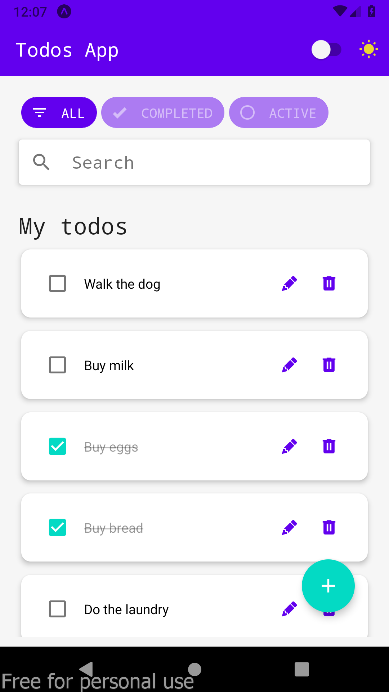
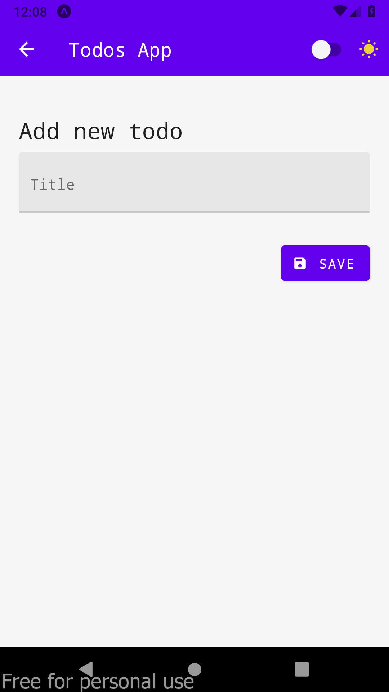
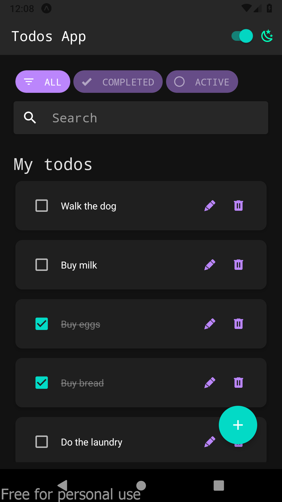
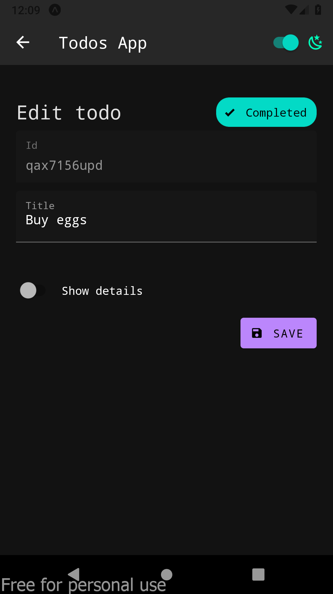

# React Native - Todo App

A sample todo app using `Expo` and `React Native` with `TypeScript`.

## Demo

https://neo-ciber94.github.io/ReactNativeTodoApp/

## Screenshots

### List

### Add

### List (Dark mode)

### Edit (Dark mode)

